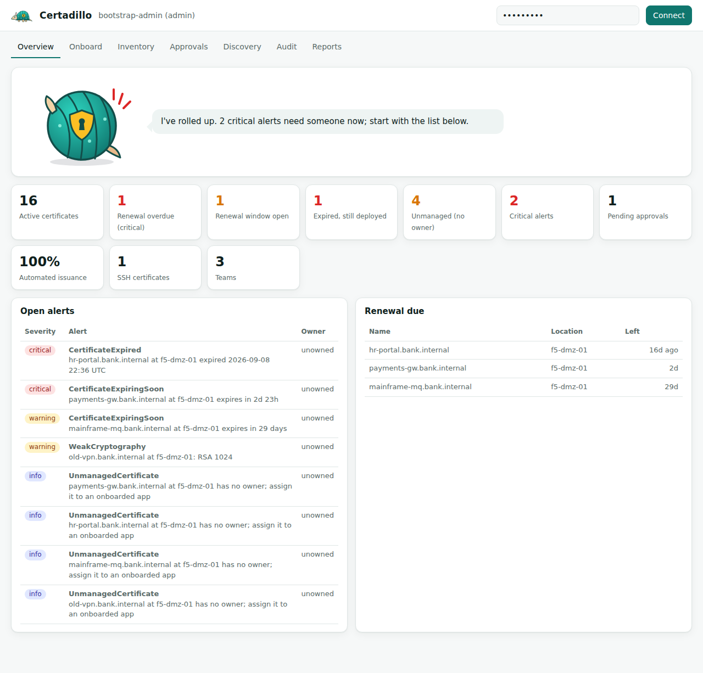
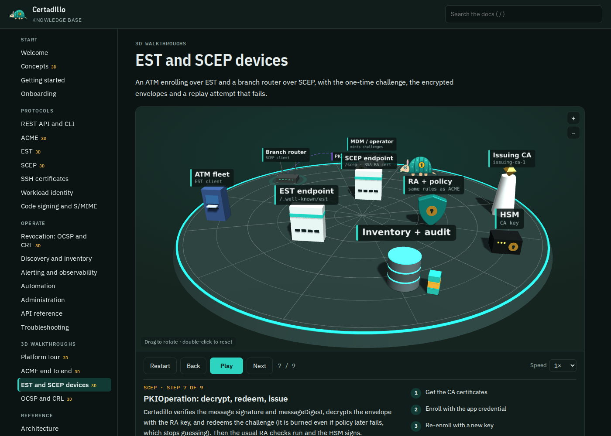

<p align="center"></p>

# Certadillo

Certadillo is an open source PKI and certificate lifecycle platform for regulated shops. It runs an internal CA hierarchy, enrolls certificates over REST, ACME, EST, SCEP and SSH, keeps an inventory of every certificate it issued or found on the network, and tells the owning team before anything expires. Dilly, the armadillo on top, rolls into a ball when something is critical.

It was built as a reference implementation of what a bank's certificate management service needs: one registration authority in front of every protocol, dual control on sensitive operations, CA keys in an HSM, a tamper-evident audit trail, and reports an auditor can use (PCI DSS v4.0 4.2.1.1 inventory, a CycloneDX crypto bill of materials).



## Try it

- Live demo: [certadillo.com](https://certadillo.com), loaded with demo teams, apps, certificates, a few weak legacy certificates and the alerts they raise.
- Documentation and 3D protocol walkthroughs: [certadillo.com/kb](https://certadillo.com/kb/)
- API reference (OpenAPI): [certadillo.com/docs](https://certadillo.com/docs)

The console and the API need an API key. To get one, [open an issue](https://github.com/FlavioImbertDomingos/certadillo/issues/new?template=api-key-request.yml) saying what you want to try. Keys are sent privately by email, never posted in the issue, so either leave an address in the issue or write to manager@pulseai.systems with the issue number. Demo keys are read-only unless you ask for more.

## What works today

Every row below has automated tests. "Interop" means a third-party client was run against it, not only our own code.

| Area | What you get | Evidence |
| --- | --- | --- |
| CA hierarchy | Offline-style root (P-384, 20y, pathlen 1) and issuing CA (5y, pathlen 0); more sub-CAs through dual control | `tests/test_lifecycle.py` |
| Key custody | CA keys in any PKCS#11 HSM (tested on SoftHSM2), generated sensitive and non-extractable; software keys for labs | `test_ca_keys_in_pkcs11_hsm` |
| Registration authority | Teams, apps, per-app name scope (DNS, SPIFFE IDs, mail domains), profiles, environments | `test_policy_violations` |
| Dual control | Maker-checker for prod onboarding, code signing, new CAs; the requester cannot approve | `test_prod_onboarding_needs_second_person` |
| Policy engine | Key type and size, curves, SAN scope, wildcards, validity caps, forced key rotation on renewal, change ticket for prod revocations | `test_policy_violations`, `test_renewal_requires_new_key` |
| ACME (RFC 8555) | EAB-bound accounts, http-01, orders, finalize, revoke; optional pre-validated RA scope mode | certbot interop: `scripts/interop-certbot.sh` |
| EST (RFC 7030) | cacerts, simpleenroll, simplereenroll | `test_est_cacerts_and_enroll` |
| SCEP (RFC 8894) | GetCACaps, GetCACert, PKIOperation with an RSA RA certificate; one-time challenge passwords bound to an app (the NDES/Intune pattern) | micromdm scepclient interop: `scripts/interop-scep.sh`, `tests/test_scep.py` |
| SSH certificates | User and host certificates from an Ed25519 SSH CA, short-lived, source-address pinning | `test_ssh_user_and_host_certs` |
| Workload identity | SPIFFE X.509-SVIDs (URI SAN, 24h default) and a SPIFFE trust bundle endpoint | `test_spiffe_svid_and_bundle` |
| Code signing, S/MIME | Profiles with the right EKUs; code signing always needs a second approver | `test_code_signing_dual_control`, `test_smime_profile` |
| Revocation | CRL per CA (published on a timer and on every revoke), OCSP with a delegated responder cert | openssl ocsp interop + tests |
| Discovery | TLS scanner (host:port, CIDR:port), PEM import, Vault PKI and Kubernetes TLS secret connectors | `test_discovery_scan_*`, `test_inventory_connectors` |
| Alerting | Lifetime-aware expiry thresholds, weak crypto, unowned certs, CA expiry, stale CRL, broken audit chain; routed per team; Slack, webhook, Jira, ServiceNow | `test_alert_lifecycle_and_routing`, `test_ticketing_notifiers` |
| Observability | Prometheus metrics, JSON logs with request IDs, Prometheus rules, Alertmanager routing, Grafana dashboard | `promtool check rules`, compose stack |
| Audit | SHA-256 hash-chained audit log, verify endpoint, metric and alert on tampering | `test_audit_chain_detects_tampering` |
| Crypto agility / PQC | CycloneDX 1.6 CBOM, PQC readiness report, CA-outlives-2035 check, algorithm-agnostic signer layer | `test_reports` |
| Automation | CLI (`cert request`, `cert renew-if-due`), Ansible role, PowerShell module, Python demo seeder | Ansible and PowerShell run against a live server |
| Backends | Local CA and HashiCorp Vault / OpenBao PKI (`sign/:role`, `revoke`) | `test_vault_backend_contract` (mock) |

Not built yet, with the design written down: ACME dns-01 and ARI, Venafi / DigiCert / Keyfactor / AD CS connectors, a SPIRE UpstreamAuthority, a Helm chart, OIDC login for the console, and ML-DSA issuance (waiting on pyca/cryptography). See [docs/ROADMAP.md](docs/ROADMAP.md).

## Quick start

Local, SQLite, software keys:

```bash
pip install -e ".[dev,hsm]"
make test                                      # 41 tests; the HSM test runs if SoftHSM2 is installed
make run                                       # http://localhost:8080, admin key "admin-key"
make demo                                      # seed teams, apps, certificates and some bad legacy certs
```

Full stack with PostgreSQL, Prometheus, Alertmanager and Grafana:

```bash
cp deploy/.env.example deploy/.env             # set real keys and passwords
make up
# console :8080   prometheus :9090   alertmanager :9093   grafana :3000 (PKI folder)
```

## Five-minute tour with curl

```bash
S=http://localhost:8080; A=(-H "X-API-Key: admin-key" -H "Content-Type: application/json")

# 1. onboard a team and an app; the app may only get names under *.cards.bank.internal
curl -s "${A[@]}" -X POST $S/api/v1/teams -d '{"name":"cards","contact_email":"cards-sre@bank.example"}'
curl -s "${A[@]}" -X POST $S/api/v1/apps  -d '{"team_id":1,"name":"card-auth","environment":"dev",
      "profile":"tls-server","allowed_domains":["*.cards.bank.internal"]}'
KEY=$(curl -s "${A[@]}" -X POST $S/api/v1/apps/1/credentials | jq -r .api_key)

# 2. the app requests a certificate with its own key pair
export CERTADILLO_SERVER=$S CERTADILLO_API_KEY=$KEY
certadillo cert request --cn auth.cards.bank.internal --san auth.cards.bank.internal --out ./tls

# 3. or with ACME
curl -s "${A[@]}" -X POST $S/api/v1/apps/1/acme-eab    # prints a ready-to-run certbot command

# 4. look at the estate
curl -s "${A[@]}" $S/api/v1/reports/summary
curl -s "${A[@]}" "$S/api/v1/reports/pci-inventory?format=csv"
curl -s "${A[@]}" $S/api/v1/reports/cbom > cbom.cdx.json
```

Interactive API docs are at `/docs` (OpenAPI).

## Repository layout

```
src/certadillo/
  ca/            CA hierarchy, issuance, CRL (authority.py), SSH CA, issuer backends (Vault)
  crypto/        Signer abstraction: software keys, PKCS#11 HSM, DER re-signing for HSM keys
  policy/        profile evaluation and certificate grading
  services.py    registration authority: onboarding, dual control, issue, renew, revoke, ingest
  enrollment/    ACME, EST and SCEP front ends
  revocation/    OCSP responder
  discovery/     TLS scanner and inventory connectors
  alerting/      evaluator and notifiers (webhook, Slack, Jira, ServiceNow)
  observability/ Prometheus metrics and JSON logging
  reporting/     summary, crypto/PQC report, CycloneDX CBOM, PCI inventory
  api/           FastAPI app, REST v1, PKI repository endpoints, web console
  web/static/    console and mascot
Dockerfile       container image (SoftHSM2 and OpenSC included)
deploy/          compose stack, Prometheus rules, Alertmanager, Grafana
automation/      Ansible role, PowerShell module
scripts/         demo seeder, certbot and SCEP interop tests
docs/            architecture, runbook, security model, HSM guide, roadmap, standards map
```

## Documentation

- [User guide](docs/guide/README.md): onboarding and every protocol with copy-paste examples
- [Knowledge base](https://certadillo.com/kb/) with interactive 3D protocol walkthroughs (ACME, EST and SCEP, OCSP and CRL, platform tour): also served at `/kb` by any running server; rebuild it with `python scripts/build_kb.py`


- [Architecture](docs/ARCHITECTURE.md): modules, trust model, request flow, deployment topology
- [Runbook](docs/RUNBOOK.md): one section per alert, plus key ceremony and mass-revocation procedures
- [Security model](docs/SECURITY.md): threats, controls, and the known gaps in this MVP
- [HSM guide](docs/HSM.md): SoftHSM2 lab and vendor PKCS#11 setup
- [Standards map](docs/STANDARDS.md): which RFC, NIST, PCI DSS and CA/B Forum requirement each module covers
- [Roadmap](docs/ROADMAP.md)

## License

Apache-2.0. Dilly the armadillo is original artwork in this repository, under the same license.

Built by Flavio Domingos.
