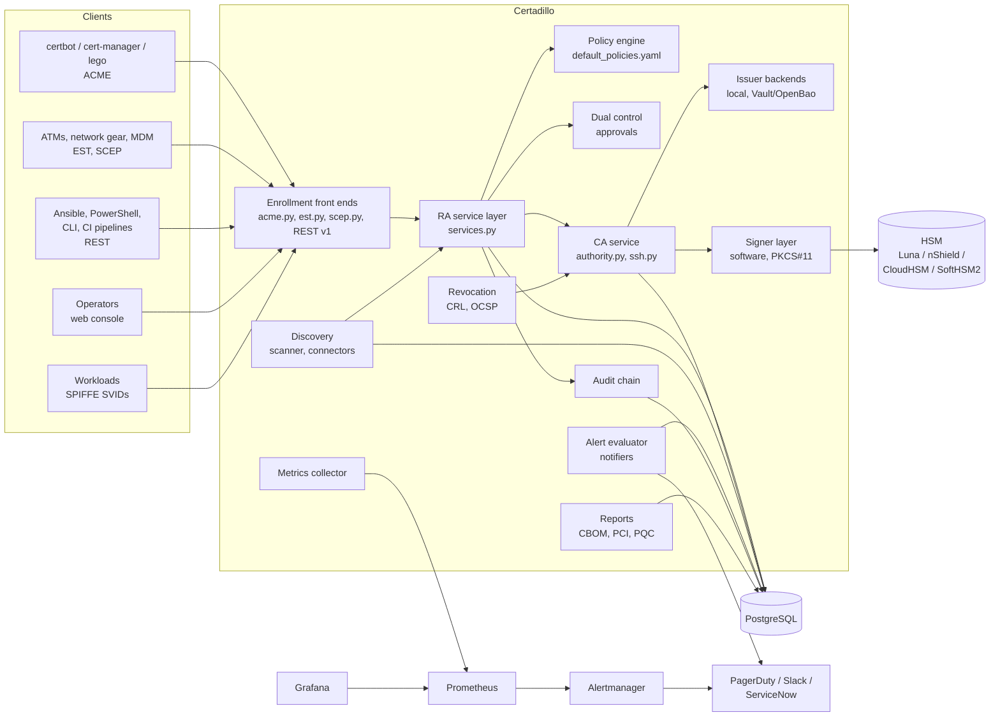

# Architecture

## Goals

1. One registration authority (RA) in front of every enrollment protocol, so a rule written once holds for REST, ACME, EST, SCEP, the CLI and the console.
2. CA private keys never exist outside an HSM in production.
3. Every certificate has an owner (team and app) before it is issued, and certificates found on the network get an owner after the fact.
4. Short-lived certificates are the default. Renewal is automated, and alerts fire only when automation has failed.
5. The platform proves what it did: hash-chained audit, maker-checker on sensitive actions, exportable inventories.
6. Swapping algorithms, CAs or HSM vendors is a configuration change.

## Component map



## Request flow: issuing a certificate

1. The client authenticates. Apps use an API key minted at onboarding (REST, EST via HTTP Basic), an ACME account bound to the app through a single-use External Account Binding credential, or a one-time SCEP challenge password minted for the app. Humans use role-scoped keys (admin, approver, operator, auditor); OIDC is on the roadmap.
2. The front end parses the protocol message and calls `Platform.request_certificate()`. Nothing else signs.
3. The RA checks the app is active and that the requested profile is the one it was onboarded for.
4. The policy engine evaluates the CSR: proof of possession, key algorithm and size, every SAN against the app's approved scope, wildcard rules, SPIFFE trust domain, validity caps, and on renewal that the key changed.
5. If the profile needs dual control (code signing), the request becomes an approval. A different principal with the approver role must approve it before anything is signed.
6. The CA service builds the certificate (AIA with OCSP and caIssuers, CDP, SKI/AKI, profile EKUs) and hands the to-be-signed bytes to the signer. For HSM keys the builder signs with a throwaway key of the same algorithm, the real signature is computed on the HSM over the TBS bytes, and the DER is rebuilt (`crypto/der.py`). The result is verified in tests against both EC and RSA keys and against SoftHSM2.
7. The certificate row and its audit event are committed in one transaction, then metrics are updated. Policy rejections, including ACME orders outside the app's scope, are audited too.

## Trust model

```
Root CA (P-384, 20 years, pathlen 1)          offline in production; online in the lab
 └── Issuing CA issuing-ca-1 (P-384, 5 years, pathlen 0)   HSM, online
      ├── TLS server / client / mTLS certificates (30 days default, 90 max)
      ├── SPIFFE X.509-SVIDs (24 hours default, 72 max)
      ├── S/MIME (1 year)
      ├── Code signing (1 year, dual control)
      ├── OCSP responder certificate (30 days, id-kp-OCSPSigning, ocsp-nocheck)
      └── SCEP RA certificate (RSA-3072, 1 year; SCEP key transport needs RSA)
SSH CA (Ed25519)                               separate trust anchor for OpenSSH
```

The OCSP responder uses a delegated certificate (RFC 6960 section 4.2.2.2) so the issuing CA key signs only certificates and CRLs, not every OCSP response. The responder certificate rotates automatically two days before expiry.

In production the root is created in a key ceremony on an offline HSM and signs issuing CA CSRs out of band. `certadillo init` creates both levels online, which is right for labs and CI only. See the ceremony section in the [runbook](RUNBOOK.md#root-key-ceremony).

## Data model

| Table | Purpose |
| --- | --- |
| teams, apps | Ownership and RA scope from onboarding |
| principals | Hashed API keys with a role; app keys point at their app |
| cas | CA certificates, key references (`file:` or `pkcs11:` label), CRL number |
| certificates | Every certificate issued, discovered or imported, with source, location, protocol, backend and status |
| approvals | Maker-checker requests and decisions |
| audit_events | Hash-chained event log |
| alerts | Alert state for de-duplication, repeat intervals and resolve notices |
| ssh_certificates | Issued SSH certificates |
| acme_* | ACME accounts, orders, authorizations, nonces, EAB credentials |

## Expiry alerting that works with short-lived certificates

A fixed "30 days before expiry" rule fires the moment a 30-day certificate is issued. Certadillo scales thresholds to the certificate's own lifetime: warning when less than `min(30 days, lifetime / 3)` remains and critical below `min(7 days, lifetime / 10)`. A 24-hour SVID warns at 8 hours and goes critical at 2.4 hours; a 398-day legacy certificate warns at 30 days. The same formula is used by the built-in evaluator and the Prometheus rules (`certadillo_certificate_lifetime_seconds` is exported for that reason). The CLI and the Ansible role renew once a third of the lifetime is left, which is never later than the warning threshold, so an alert means the automation did not run.

## Observability

- Metrics at `/metrics`: per-certificate expiry and lifetime gauges labelled with app, team and environment; inventory counts; quantum-vulnerable counts; CA expiry; CRL age; open alerts; audit chain validity; counters for issuance, policy violations, revocations, OCSP responses, discovery, notifications; histograms for signing latency per signer type and HTTP latency per route.
- Logs: one JSON object per line with a request ID that is also returned in `X-Request-ID`. Audit events are logged as well as stored.
- Dashboards and rules: `deploy/grafana/dashboards/certadillo.json` and `deploy/prometheus/rules/certadillo.rules.yml` (checked with `promtool`).

## Deployment topology for a bank

```
             ┌──────────────── DMZ ────────────────┐
Internet ──▶ │ CDN / static host: CRLs, CA certs   │   (no private keys)
             │ OCSP responders (stateless replicas)│
             └──────────────────┬──────────────────┘
                                │ read-only DB replica
             ┌──────────── Internal zone ───────────┐
Clients ───▶ │ LB (mTLS for EST) ─▶ Certadillo API ×N │── PKCS#11 ──▶ HSM cluster (FIPS 140-3 L3)
             │ Housekeeping job (single leader)     │
             │ PostgreSQL HA (Patroni / RDS)        │
             │ Prometheus, Alertmanager, Grafana    │── ServiceNow, PagerDuty, SIEM
             └──────────────────────────────────────┘
Offline root: air-gapped HSM, used in ceremonies only.
```

The API is stateless apart from the database, so it scales horizontally. The housekeeping loop (CRL publishing and alert evaluation) should run on one replica; set `CERTADILLO_ALERT_INTERVAL` high on the others or run `certadillo alerts run` as a Kubernetes CronJob. Leader election is on the roadmap.

## Extension points

| To add | Implement | Registered by |
| --- | --- | --- |
| A new CA (AD CS, EJBCA, AWS Private CA, DigiCert) | `CABackend.sign()` and `.revoke()` | `register_backend()`, then `issuer:` in a profile |
| A new inventory source (F5, ACM, Key Vault, Venafi) | `InventoryConnector.collect()` yielding `(cert, location)` | call `Platform.ingest()` |
| A new HSM or KMS | `Signer.sign()` and `.public_key()` plus a key store | `build_keystore()` |
| A new alert channel | `Notifier.send()` | `build_global_notifiers()` |
| A new certificate type | a profile in the policy YAML | config only |
