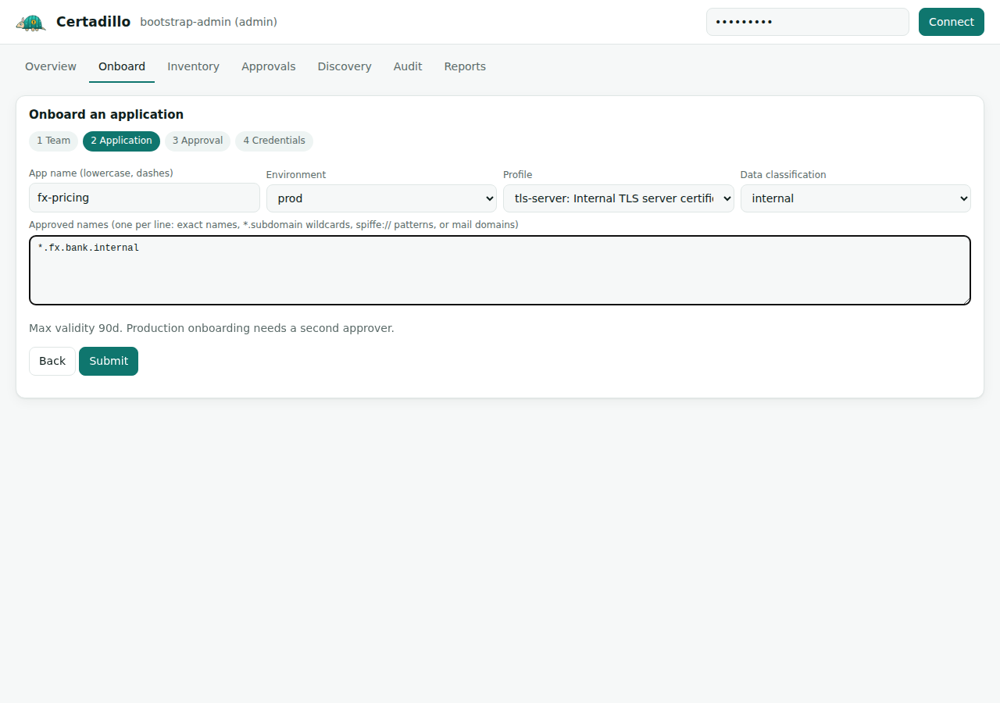

# Onboarding

Onboarding answers three questions before any certificate exists: who owns it, which names it may carry, and how it will be requested. After onboarding, the app team runs without the PKI team in the loop.

## 1. Create or pick a team

Teams receive alerts for their certificates, so give them a real contact and, if you have one, a chat webhook.

```bash
curl -s "${A[@]}" -X POST $S/api/v1/teams -d '{
  "name": "payments-platform",
  "contact_email": "payments-sre@bank.example",
  "chat_channel": "#payments-sre",
  "webhook_url": "https://hooks.slack.com/services/T000/B000/XXXX",
  "cost_center": "CC-4411"
}'
```

A `hooks.slack.com` URL gets Slack-formatted messages; anything else gets an Alertmanager-compatible JSON payload.

## 2. Onboard the app

```bash
curl -s "${A[@]}" -X POST $S/api/v1/apps -d '{
  "team_id": 1,
  "name": "card-auth-api",
  "environment": "prod",
  "profile": "mtls-service",
  "allowed_domains": ["*.cards.bank.internal"],
  "data_classification": "pci"
}'
```

Choosing the fields:

| Field | Guidance |
| --- | --- |
| `name` | lowercase letters, digits and dashes; appears in alerts and reports |
| `environment` | `prod` onboarding needs a second person (see below) |
| `profile` | see the table in [Concepts](01-concepts.md#the-pieces); one profile per app, onboard a second app if you need two |
| `allowed_domains` | as narrow as possible. `*.cards.bank.internal` beats `*.bank.internal` |
| `data_classification` | `pci` marks certificates that protect card data; they appear as such in the PCI DSS 4.2.1.1 inventory |

### Production apps need an approver

A `prod` app starts as `pending_approval` and the response includes an `approval_id`. Someone with the `approver` role, other than the requester, approves it:

```bash
curl -s -H "X-API-Key: $APPROVER_KEY" -X POST $S/api/v1/approvals/1/approve \
  -H "Content-Type: application/json" -d '{"comment": "CHG0012345 approved at CAB"}'
```

Until then the app cannot get credentials. Rejections set the app to `rejected`.

## 3. Pick how the app will enroll

| The client is | Use | Credential to mint |
| --- | --- | --- |
| a script, pipeline, Ansible, PowerShell | [REST / CLI](04-rest-api.md) | `POST /api/v1/apps/{id}/credentials` (API key) |
| a web server, Kubernetes, anything with an ACME client | [ACME](05-acme.md) | `POST /api/v1/apps/{id}/acme-eab` (single-use EAB key) |
| a device with EST support | [EST](06-est.md) | API key, used as the HTTP Basic password |
| an MDM-managed or legacy device with SCEP | [SCEP](07-scep.md) | `POST /api/v1/apps/{id}/scep-challenge` (one-time challenge per device) |
| a person or host needing SSH access | [SSH](08-ssh.md) | API key |

Every credential is shown once. Store it in your secrets manager (Vault, CyberArk, AWS Secrets Manager); never commit it.

## Doing it in the console

The Onboard tab walks the same four steps: team, application, approval, credentials. The last step prints ready-to-paste snippets for the CLI, EST, certbot and cert-manager.



## After onboarding

- The app's certificates appear in the inventory with its team and classification.
- Expiry alerts for them go to the team's webhook as well as the global channels.
- Certificates found by discovery can be assigned to the app: `POST /api/v1/certificates/{id}/assign {"app_id": N}`.
- To retire an app's credential: `POST /api/v1/principals/{name}/deactivate` (admin).
